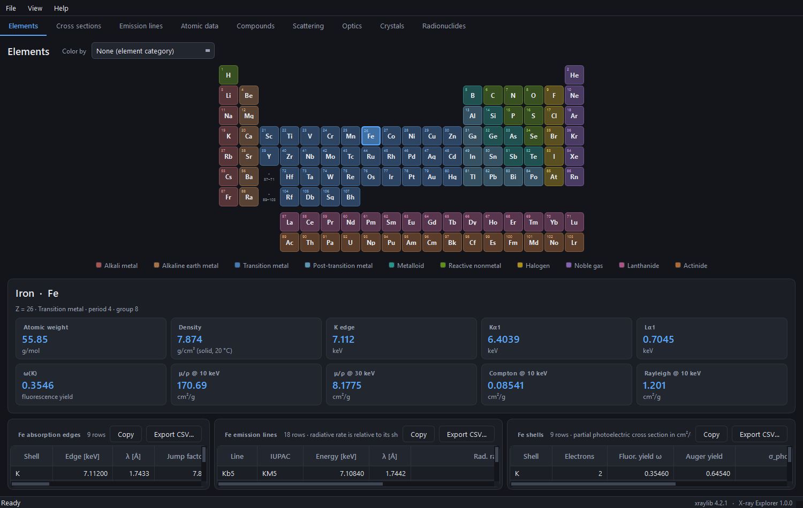
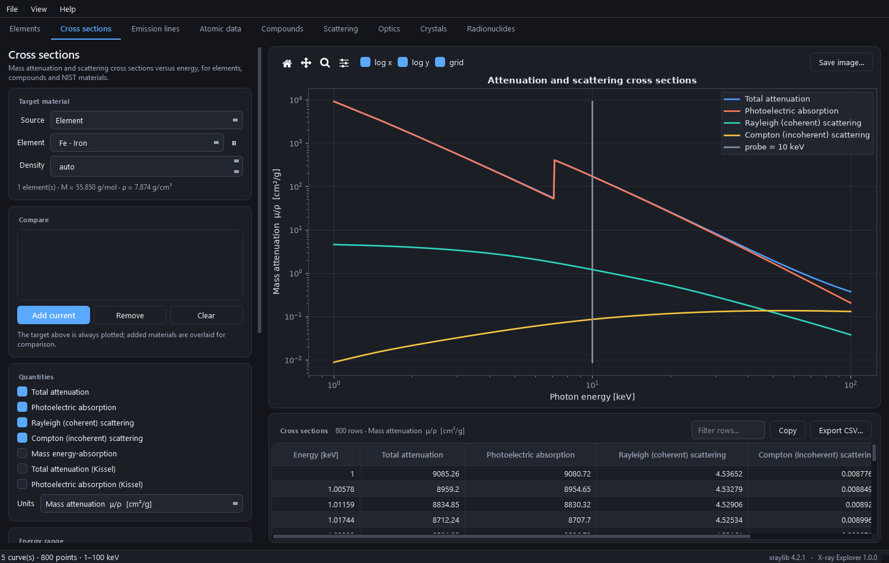
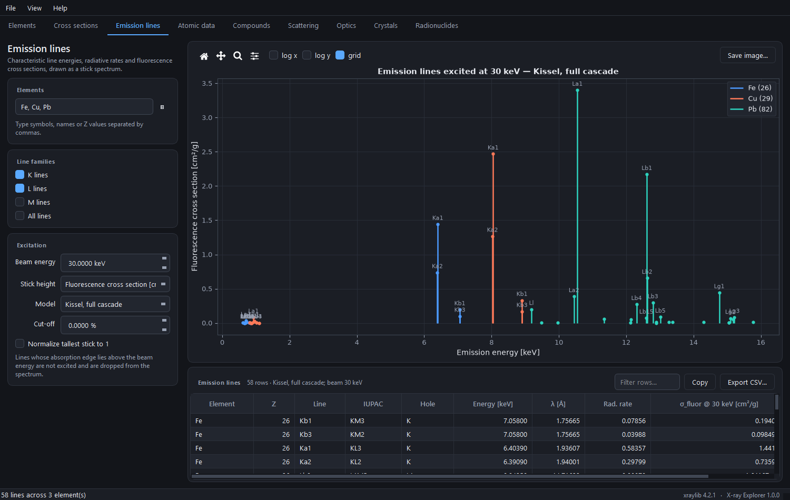
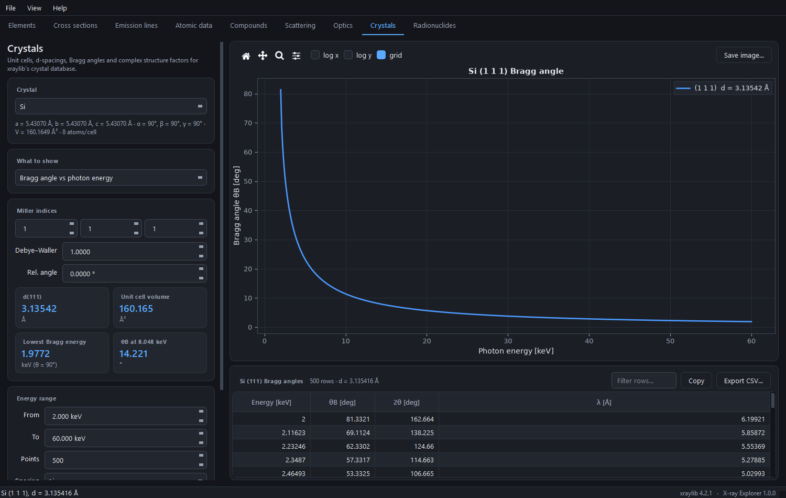

# X-ray Explorer

A cross-platform desktop GUI for [xraylib](https://github.com/tschoonj/xraylib), the X-ray physics database of Schoonjans et al.

Look up a single value, build a table across a whole element range or energy grid, plot it and export it, without writing a script. The program runs on Windows, macOS and Linux. It ships as a self-contained bundle with an installer, so users need neither Python nor a separate xraylib installation.




## Contents

- [Motivation](#motivation)
- [What it does](#what-it-does)
- [Technology stack](#technology-stack)
- [Install and run from source](#install-and-run-from-source)
- [Building an executable and installer](#building-an-executable-and-installer)
- [Using the program](#using-the-program)
- [Notes on the physics](#notes-on-the-physics)
- [Project layout](#project-layout)
- [Generative AI disclosure](#generative-ai-disclosure)
- [License](#license)
- [Credits and citation](#credits-and-citation)

## Motivation

I contributed the C# and Delphi bindings to xraylib and use the library regularly. What I wanted was a simple cross-platform GUI I could share with colleagues, so that the data are browsable without anyone having to write code first, and so that a question about an edge energy or an attenuation length takes a few seconds rather than a scratch script.

The second reason was more specific. I wanted a tool to examine some potential problems with the anomalous scattering factors f' and f" near absorption edges, because that is where the tabulated values are most likely to misbehave and least likely to be noticed. The [Atomic data](#4-atomic-data) tab plots them across a range of atomic number at fixed energy, and the [Optical constants](#7-optical-constants) tab plots delta and beta across an energy grid. Narrow the energy range around an edge and the structure, or its absence, becomes visible.

The third reason was to learn what current generative AI tools can do as a scientific assistant. This was a weekend project, and the [Generative AI disclosure](#generative-ai-disclosure) gives the full account of how the program was written.

## What it does

xraylib exposes about 1800 names in a flat API. X-ray Explorer arranges them into nine task-shaped views, each with a live plot and an exportable table.

| Tab | What it gives you |
| --- | --- |
| Elements | Interactive periodic table, tinted by K edge, Ka1, density or mass attenuation. Per-element panel of edges, emission lines and shell data. |
| Cross sections | Total, photoelectric, Rayleigh, Compton and energy-absorption cross sections against energy, in cm²/g, 1/cm or barn/atom. Several materials can be overlaid. Transmission and attenuation length through a given thickness. |
| Emission lines | Stick spectra of characteristic lines at a chosen beam energy, using any of the five fluorescence models in xraylib. |
| Atomic data | Sweeps any of 19 per-element quantities across a range of atomic number: edges, line energies, fluorescence and Auger yields, level widths, jump factors, Coster-Kronig probabilities and the anomalous scattering factors. |
| Compounds | Chemical formula parser, the 180 NIST reference materials and a mixture builder that blends materials by mass. |
| Scattering | Rayleigh and Compton differential cross sections against angle, in Cartesian or polar form and for polarized or unpolarized beams. Atomic form factors, Compton profiles and the Compton energy shift. |
| Optics | Complex refractive index n = 1 - delta - i*beta, the critical angle for total external reflection, attenuation length and phase shift. |
| Crystals | Unit cells and atom positions, d-spacings, Bragg angles, complex structure factors and powder patterns for all 38 built-in crystals. |
| Radionuclides | X-ray and gamma emission spectra of the 10 bundled calibration sources. |

Every number comes from xraylib, and the program only arranges, converts, tabulates and plots the values. Two quantities are, however, derived here rather than read directly, i.e. the cross sections of mixtures and the refractive index, and both were validated against the `*_CP` and `Refractive_Index_*` functions of xraylib to about 1e-9 relative agreement.



## Technology stack

| Layer | Choice | Why |
| --- | --- | --- |
| Physics data | [xraylib 4.x](https://github.com/tschoonj/xraylib), with the [documentation wiki](https://github.com/tschoonj/xraylib/wiki) | The reference open-source library for X-ray interaction data: cross sections, emission lines, edges, form factors and crystallography. An ANSI C core with SWIG bindings for Python, C#, Delphi, Fortran, IDL, Java, Lua, Perl, PHP and Ruby. |
| GUI toolkit | [PySide6](https://doc.qt.io/qtforpython/) (Qt 6) | Native appearance on all three platforms, fast model and view tables for large result sets, and a usable dark mode. It is the official Python binding for Qt, under the LGPL. |
| Plotting | [matplotlib](https://matplotlib.org/), QtAgg backend | Publication-quality output that embeds cleanly in Qt and exports to PNG, SVG and PDF. |
| Numerics | [NumPy](https://numpy.org/) | Energy grids and vectorized post-processing. xraylib itself is scalar, so the program loops over energies and collects the results into arrays. |
| Packaging | [PyInstaller](https://pyinstaller.org/) | Freezes CPython and every dependency into a self-contained directory. |
| Windows installer | [Inno Setup 6](https://jrsoftware.org/isinfo.php) | A free and widely used compiler that produces a single setup executable, which can be signed. |
| macOS and Linux | `hdiutil` for the disk image, [AppImage](https://appimage.org/) for Linux | Native distribution formats that need no package manager on the target machine. |

The computation layer in `xrlgui/core.py` imports nothing from Qt, so it can be used from a plain script or a notebook without starting the GUI.

## Install and run from source

Python 3.10 or newer is required. xraylib is the one dependency that is not always a plain `pip install`, because it is a C library. The most reliable route is conda:

```bash
conda install -c conda-forge xraylib
```

Then install the rest:

```bash
pip install PySide6 matplotlib numpy
```

Where xraylib wheels are published for your platform, a single command works instead:

```bash
pip install -r requirements.txt
```

Run the program:

```bash
python main.py
```

The [xraylib installation instructions](https://github.com/tschoonj/xraylib/wiki/Installation-instructions) cover the cases where the library has to be built from source.

## Building an executable and installer

The build produces a self-contained bundle. CPython, Qt, matplotlib, NumPy and xraylib are all included, so nothing needs to be preinstalled on the target machine.

```bash
pip install pyinstaller
python packaging/build.py
```

Three flags change what the build does:

```bash
python packaging/build.py --clean          # delete build/ and dist/ first
python packaging/build.py --no-installer   # build the bundle only
python packaging/build.py --no-smoke-test  # skip the post-build launch check
```

### What you get

| Platform | Bundle | Installer |
| --- | --- | --- |
| Windows | `dist/X-ray Explorer/XrayExplorer.exe` | `dist/installer/X-rayExplorer-<version>-windows-x64-setup.exe` |
| macOS | `dist/X-ray Explorer.app` | `dist/installer/XrayExplorer-<version>-macos-<arch>.dmg` |
| Linux | `dist/X-ray Explorer/XrayExplorer` | `dist/installer/XrayExplorer-<version>-linux-<arch>.AppImage` |

Unpacked, the bundle is about 195 MB, and the Windows installer about 58 MB. Qt accounts for roughly half of that.

### Prerequisites for each platform

Windows needs [Inno Setup 6](https://jrsoftware.org/isdl.php). Without it the build falls back to a `.zip` archive. macOS needs `hdiutil`, which is part of the base system, so there is nothing to install. Linux needs [`appimagetool`](https://github.com/AppImage/AppImageKit/releases) on the `PATH`, and without it the build produces a `.tar.gz` containing a ready-to-run AppDir instead.

### Cross-compiling is not possible

PyInstaller freezes the interpreter it is running under, so each artifact has to be built on its own platform. In order to produce all three you therefore have to run `packaging/build.py` once per target operating system, which a three-job CI matrix does well.

### Build safeguards

After freezing, `build.py` launches the bundle with `XRAYEXPLORER_SELFTEST=1` and no display. In that mode the program computes every tab, exports a figure to PNG, SVG and PDF, checks three known xraylib values (the Fe K edge, Cu Ka1 and the mass attenuation coefficient of water at 10 keV) and then exits, so that a bundle which cannot start is caught before it is packaged rather than after it is shipped. The build stops on a failure or a hang. Two real faults were found this way: the startup crash caused by excluding Pillow, and a missing pair of matplotlib output backends that would have broken SVG and PDF export in every packaged build.

## Using the program

### Controls common to every tab

Everything updates live. Change any control and both the plot and the table recompute, so there is no calculate button, and controls sit on the left with results on the right behind a divider that can be dragged. Tables sort when a column header is clicked and filter from the box above them. Copy places the selection on the clipboard as tab-separated text, ready to paste into a spreadsheet, or the whole table when nothing is selected, while Export CSV writes exactly the rows currently shown in the order shown. Plots carry log and grid toggles, pan and zoom, a live coordinate readout and a save button for PNG, SVG or PDF.

Values that xraylib does not tabulate appear as a dash. The library raises an error for a physically meaningless request, such as a K line for hydrogen or an M5 edge for carbon, and the program turns those into gaps rather than errors, so a whole element range can be swept safely.

Keyboard shortcuts: `Ctrl+1` to `Ctrl+9` switch tabs, `Ctrl+T` toggles the light and dark themes, `Ctrl+E` exports the current table and `Ctrl+S` saves the current plot. In addition, the theme and the window geometry persist between sessions.

### 1. Elements

Elements is the landing page. Click any element to load its data into the panel below, and use the Color by control to re-tint the whole table as a heat map of the K edge, Ka1, L3 edge, atomic weight, density, K fluorescence yield or mass attenuation at 10 keV. Each cell then shows its value, and the range of the scale appears on the right.

Below the table sit headline tiles and three further tables, covering the absorption edges (energy, wavelength, jump factor and level width), the emission lines (Siegbahn and IUPAC names, energy, wavelength and radiative rate) and the shells (occupancy, fluorescence and Auger yields, and the partial photoelectric cross section).

### 2. Cross sections

Choose the target as an element, a chemical formula or a NIST material. The add button pushes that target onto the comparison list so that several materials are overlaid on one plot, and the current target is always drawn. Tick any combination of the total, photoelectric, Rayleigh, Compton and energy-absorption cross sections, together with the Kissel variants. Units are cm²/g, 1/cm (which needs a density) or barn/atom.

Set an energy and a thickness in the probe panel to obtain the mass attenuation coefficient, the cross section per atom, the linear attenuation coefficient, the 1/e attenuation length and the transmitted and absorbed fractions. A marker line shows the probe energy on the plot. Note that a chemical formula carries no tabulated density, so set one explicitly. The information line under the material box states when the density is missing.

### 3. Emission lines

Enter several elements at once, as symbols, names or atomic numbers, or select them from the periodic table popup. Choose the K, L or M line families, or every line constant that xraylib defines, which runs to hundreds per element.

Stick height is either the fluorescence cross section or the relative radiative rate, and five fluorescence models range from the simple jump-factor approximation through to Kissel with the full cascade. Lines whose absorption edge lies above the beam energy are not excited, so they are dropped automatically, and the cut-off control hides lines below a chosen percentage of the strongest.



### 4. Atomic data

This tab is the one for building tables. Select one of 19 quantities, tick the shells, lines or transitions to be drawn as separate curves, and set a range of atomic number. The quantities are the absorption edge energy, emission line energy, radiative rate, fluorescence yield, Auger yield, atomic level width, edge jump factor, electron occupancy, Coster-Kronig probability, Auger transition rate, atomic weight, element density, the mass attenuation coefficients at fixed energy (total, photoelectric, Rayleigh, Compton and energy-absorption) and the anomalous scattering factors f' and f".

To examine the behavior of f' and f" at an edge, select the anomalous scattering factor, set the energy just below the edge, then just above it, and compare the two sweeps. The filter box above the shell and line list helps when that list runs to hundreds of entries.

### 5. Compounds and materials

Materials come from one of three sources. A chemical formula accepts nested groups and fractional subscripts, e.g. `Ca5(PO4)3F` and `Fe0.7Cr0.3`. The NIST list searches the 180 bundled reference materials. The mixture builder takes components by formula or NIST name with relative weights, which are then normalized by mass, and estimates the density by volume addition when every component has one.

Results break the material down into atoms per formula unit, atomic and mass fractions, atomic weight, the mass attenuation coefficient of each element and its share of the total, while tiles give the molar mass, density, mean atomic number, mean atomic mass, electron density and 1/e depth.

### 6. Scattering

This tab has four modes. The first plots differential cross sections against angle for Rayleigh and Compton scattering per element, with optional Thomson and Klein-Nishina free-electron references. Tick the polarized beam option to use the azimuthal angle, and the polar plot option to show the angular distribution as a lobe. The remaining modes plot the coherent and incoherent form factors against momentum transfer, the Compton profile, and the Compton energy shift with the scattered energy, transferred energy, scattered wavelength and momentum transfer.

### 7. Optical constants

For a material with a density, this tab plots delta and beta against energy, together with the critical angle for total external reflection, the attenuation length and the phase shift per µm, and the tiles give the same quantities at a single probe energy. It is the other useful place to inspect edge behavior, because narrowing the energy range around an edge shows the discontinuity in both delta and beta.

### 8. Crystals

All 38 crystals in the xraylib database can be selected, and each is shown in one of four modes. Bragg angle against photon energy, for one set of Miller indices, is the simplest. A reflection table lists every reflection up to a chosen maximum index, sorted by d-spacing, with the Bragg angle, the complex structure factor and the minimum energy, and its plot is a powder pattern of the squared structure factor against 2*theta with symmetry-equivalent reflections merged. Forbidden reflections show a structure factor of about zero. Remaining modes plot the real part, imaginary part and magnitude of the structure factor against energy, and list the unit cell atom positions with a projection along the c axis. Tiles give the d-spacing, unit cell volume, lowest Bragg energy and the Bragg angle at the reference energy.



### 9. Radionuclides

The ten bundled calibration sources are 55Fe, 57Co, 109Cd, 125I, 137Cs, 133Ba, 153Gd, 238Pu, 241Am and 244Cm, and their X-ray and gamma lines are drawn as a stick spectrum with intensities in photons per decay. Note that the X-rays are those of the daughter element, which the header states explicitly.

## Notes on the physics

Cross sections for compounds and mixtures are combined from the elemental values by mass fraction. This is what the `*_CP` functions of xraylib do internally, but it also works for mixtures that have no formula string, and the result agrees exactly with `CS_Total_CP` for pure formulas. The barn per atom unit for a multi-element material uses the mean atomic mass, 1/sum(w_i/A_i), and is therefore the cross section per average atom rather than per formula unit.

For the refractive index, delta is calculated as r_e*lambda²/(2*pi) * rho*N_A * sum(w_i/A_i)(Z_i + f'_i) and beta as mu*lambda/(4*pi), and both match `Refractive_Index_Re` and `Refractive_Index_Im` for single-formula materials to about 1e-9 relative. The mixture-capable form is what makes the NIST materials and the custom blends work at all, since the xraylib functions take a formula string. Where a mixture density is not given it is estimated by the volume-additive rule, and only when every component has a known density. Element coverage follows xraylib: symbols to atomic number 107, atomic weights to 103 and densities to 98.

## Project layout

```
main.py                     launcher
xrlgui/
  core.py                   xraylib wrappers, Material class, Table and Series containers
  elements.py               periodic table reference data
  theme.py                  palettes, Qt stylesheet, matching matplotlib style
  branding.py               the application mark, shared by the window and the packaged icons
  app.py                    main window, menus, theme handling, self-test
  widgets/
    plot.py                 matplotlib canvas panel
    table.py                sortable, filterable and exportable table
    inputs.py               cards, energy grids, material and element pickers
    periodic.py             interactive periodic table
  tabs/
    base.py                 shared control column and results scaffolding
    *_tab.py                the nine feature tabs
packaging/
  build.py                  cross-platform build driver
  make_icon.py              renders .png, .ico and .icns from branding.py
  xrayexplorer.spec         PyInstaller specification
  windows/installer.iss     Inno Setup script
  linux/*.desktop           AppImage desktop entry
```

## Generative AI disclosure

A large language model wrote almost all of this program. That is worth stating plainly rather than burying in a footnote.

I did no manual coding at all. The whole application was produced by iteratively prompting Claude Code using the Claude Opus 5 model on the High reasoning setting, and the first release took about 1 to 2 hours of my time over a weekend.

The initial prompt was this, in full, with the typos corrected:

> I want to create a beautiful, cross-platform GUI in Python that is a front end to xraylib library so that the user can get values and tables of values and plot them easily.

That was the entire specification. Everything after it was refinement: a switch to American spelling, a fix to the grid toggle, some layout adjustments and the addition of the executable and installer build. xraylib is very well documented, and the models clearly know Python and the common UI toolkits well, but the first result was still impressive for a single prompt.

Generated code does not validate itself, so the numbers were checked. The Si (111) d-spacing of 3.13542 Å and Bragg angle of 14.221° at Cu Ka1, the SiO2 values of delta = 8.69e-6 and a critical angle of 4.17 mrad at 8 keV, and the diamond-structure extinction rules for silicon were all compared against literature values. The two derived quantities were checked against xraylib itself. Responsibility for the content rests with me, not with the tool.

This follows the approach of the [Nature policy on large language models](https://www.nature.com/articles/d41586-023-00191-1), under which such tools do not meet the criteria for authorship because they cannot take responsibility for the work, so their use is disclosed instead of credited. See also the [Nature editorial policy on AI](https://www.nature.com/nature-portfolio/editorial-policies/ai).

If you reuse this code for scientific work, treat it as you would any third-party code and verify the numbers that matter to your result. The underlying xraylib data are authoritative, but the presentation of those data by this program has not been reviewed by anyone else.

## License

X-ray Explorer is released under the MIT License, in [`LICENSE`](LICENSE). Packaged builds bundle third-party components under their own licenses, and Qt, used through PySide6, is the one that carries real obligations because it is licensed under the LGPL v3. That is why the build produces a directory rather than a single file: Qt remains as replaceable shared libraries, which is what the LGPL requires. [`THIRD-PARTY-NOTICES.md`](THIRD-PARTY-NOTICES.md) lists every component and every obligation that comes with redistributing a build. The bootloader exception in PyInstaller means that freezing this program does not make it GPL.

## Credits and citation

xraylib is by Tom Schoonjans and contributors. See the [repository](https://github.com/tschoonj/xraylib), the [documentation wiki](https://github.com/tschoonj/xraylib/wiki) and the [installation instructions](https://github.com/tschoonj/xraylib/wiki/Installation-instructions).

All the physics data shown by this program come from xraylib. If you publish results obtained with it, the authors ask that you cite their work. There are two papers. The 2011 paper supersedes the 2004 original and is the one to cite for current versions.

> T. Schoonjans, A. Brunetti, B. Golosio, M. Sanchez del Rio, V. A. Solé, C. Ferrero and L. Vincze, "The xraylib library for X-ray-matter interactions. Recent developments", *Spectrochimica Acta Part B* **66** (2011) 776-784. [doi:10.1016/j.sab.2011.09.011](https://doi.org/10.1016/j.sab.2011.09.011)

> A. Brunetti, M. Sanchez del Rio, B. Golosio, A. Simionovici and A. Somogyi, "A library for X-ray matter interaction cross sections for X-ray fluorescence applications", *Spectrochimica Acta Part B* **59** (2004) 1725-1731. [doi:10.1016/j.sab.2004.03.014](https://doi.org/10.1016/j.sab.2004.03.014)
